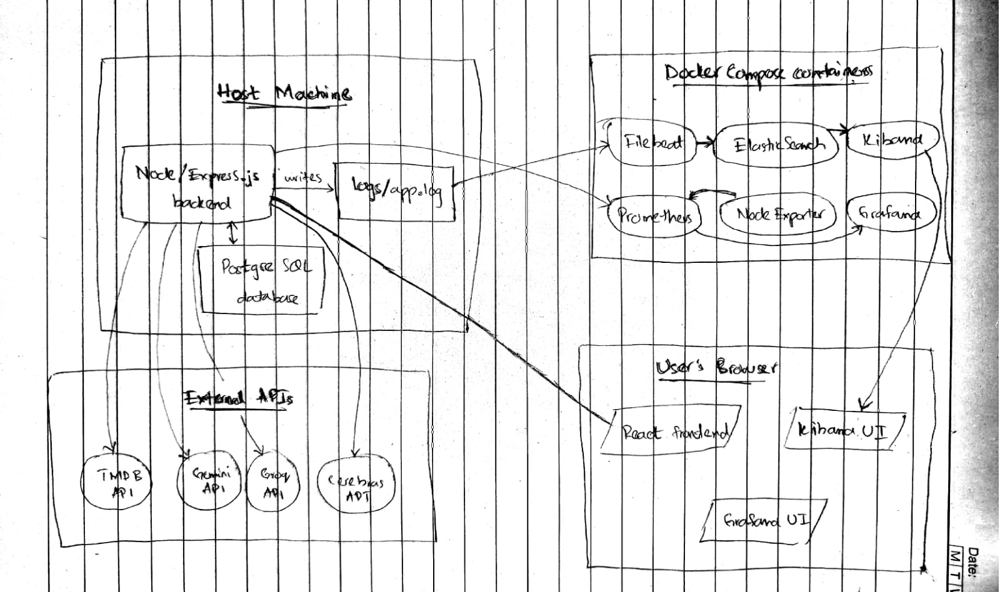

# Assignment 1: Observability Report

## Part A: WatchIt

**The Problem:** 
Finding the right movie is often overwhelming due to endless scrolling on streaming platforms, fragmented watchlists, and generic recommendations that fail to account for a user's specific viewing history. 

**Intended Users:** 
Movie enthusiasts and casual viewers who want an interactive, streamlined way to discover new films, manage their personal watchlists, and receive highly personalized curation.

**The Solution:** 
WatchIt is a premium, AI-powered movie recommendation and discovery Single Page Application (SPA). It provides an interactive, Tinder-style swiping interface allowing users to categorize movies as Watched, Watchlist, Pass, or Ignore. The core feature is "Cine Noir," a sophisticated AI chat assistant powered by a high-concurrency race between Gemini, Groq, and Cerebras APIs. The AI acts as a virtual film curator, analyzing the user's PostgreSQL database of swiped movies to deliver rapid, contextual recommendations. 

**What Works:** 
The interactive swipe matcher (including desktop keyboard navigation), dynamic TMDB metadata backfilling, personalized dashboard filtering, Firebase authentication, and the full AI chat curator are fully functional and integrated with the Drizzle ORM/PostgreSQL backend.

**How to Try It:** 
The live production build is deployed at: https://watch-it-rn.vercel.app/

To run the observability environment locally for this assignment:
1. Clone the repository and switch to the `assignment-1-observability` branch.
2. Run `npm install` to install frontend (React/Vite) and backend (Node.js/Express) dependencies.
3. Configure your local `.env` file with your PostgreSQL connection string and required API keys (TMDB, Gemini/Groq/Cerebras).
4. Start the application servers using `npm run dev`.
5. Start the local monitoring infrastructure by running `docker compose up -d` to spin up Prometheus and Grafana.

## Part B: Metrics

I successfully instrumented my Node.js/Express backend with a Prometheus client and exposed a `/metrics` endpoint. 

| Metric Name | Purpose | Type | Unit | Labels | Code Location | Grafana Query |
| :--- | :--- | :--- | :--- | :--- | :--- | :--- |
| `watchit_movie_swipes_total` | Tracks user movie intent (Business Metric) | Counter | Swipes | `action` | `app.ts` - inside `/api/swipe` POST route | `sum(watchit_movie_swipes_total) by (action)` |
| `watchit_active_ai_requests` | Monitors active AI generations (App Metric) | Gauge | Requests | None | `gemini.ts` - wraps `Promise.any` AI race | `watchit_active_ai_requests` |
| `watchit_ai_generation_duration_seconds` | AI API latency tracking (App Metric) | Histogram | Seconds | `le` (buckets) | `gemini.ts` - times the LLM network request | `histogram_quantile(0.95, sum(rate(watchit_ai_generation_duration_seconds_bucket[5m])) by (le))` |
| `watchit_db_query_duration_seconds` | Tracks PostgreSQL latency (App Metric) | Summary | Seconds | `quantile` | `app.ts` - inside `/api/profile` GET route | `watchit_db_query_duration_seconds{quantile="0.95"}` |

### Grafana Charts Explanation
*   **Swipes (Counter):** Shows the total count of user interactions, grouped by the label `action` (e.g., comparing "Watched" vs "Pass" intent).
*   **Active Requests (Gauge):** A real-time tracker that spikes when multiple users are concurrently asking the AI for recommendations and drops to 0 when idle.
*   **AI Latency p95 (Histogram):** The query uses `histogram_quantile` to calculate the 95th percentile of AI response times over a 5-minute rolling window, ensuring we see the worst-case delays.
*   **DB Latency p95 (Summary):** Directly queries the pre-calculated 95th percentile from the Prometheus client to monitor database health.

## Part C: Logs

**1. What, why, and where we log:**
I log every incoming HTTP request and API errors using the `winston` library in Node.js. Request logging happens via a global middleware in `app.ts`, attaching a unique `request_id` to trace user journeys. The logs are written locally to `logs/app.log` in JSON format. The service name was explicitly mapped as `service_name` to prevent ECS mapping conflicts in Elasticsearch.

**2. Filebeat Collection and Parsing:**
A Dockerized Filebeat instance is configured with a `filestream` input mapped to a read-only volume (`/app-logs`). It reads the `ndjson` lines and forwards them directly to Elasticsearch. Data Streams were disabled, and a custom index template (`watchit-logs-*`) was applied to prevent built-in template priority collisions.

**3. Log Storage and Lifecycle:**
Logs reside inside a local Elasticsearch container. Searching is performed in Kibana by querying the `watchit-logs-*` Data View.

**4. Searching in Kibana:**
To trace a specific request flow or debug an issue, I use the KQL search bar in the Discover tab. For example:
`severity: "error" and request_id: "36fcadd0-04a3-43fc-a22d-3945387cd478"`

**Sample Stored Log:**
```json
{
  "level": "info",
  "message": "Incoming POST request to /api/swipe",
  "time": "2026-09-19T15:08:42.919Z",
  "service_name": "watchit-backend",
  "severity": "info",
  "request_id": "47c63250-9b44-4ac1-92ab-adffc6701751"
}
```

## Part D: System Design

### 1. Architecture Diagram



**What each component does, and how they talk to each other**
*   **React 19 SPA (browser):** The frontend, built with Vite. Calls the backend's `/api/ *` routes over HTTPS and separately opens the Grafana and Kibana UIs so the developer can view dashboards and logs.
*   **Node.js 22 / Express 4 backend (host machine, not containerized):** `app.ts` exposes all application routes, the Winston logger, and the `prom-client` metrics registry at `GET /metrics`. It runs directly on the host (port 3000) rather than in Docker so that development keeps hot-reloading.
*   **PostgreSQL (external, hosted):** The single source of truth for all persisted application data (users, movies, swipes, conversations, messages), reached over a SQL/TCP connection via Drizzle ORM using `DATABASE_URL`.
*   **TMDB / Gemini / Groq / Cerebras APIs (external):** TMDB supplies movie metadata; the three LLM providers are raced concurrently with `Promise.any()` in `server/gemini.ts` for the AI chat feature. Only one response is used per request—whichever provider answers first.
*   **Filebeat (container):** Tails `logs/app.log` through a read-only Docker volume mount (`./logs -> /app-logs`), parses each line as NDJSON, and pushes the parsed documents to Elasticsearch over HTTP. This is a push: Filebeat initiates the connection to Elasticsearch as soon as new lines appear.
*   **Elasticsearch (container):** Stores and indexes the shipped logs under a daily rotating index, `watchit-logs-YYYY.MM.dd`.
*   **Kibana (container):** Queries Elasticsearch and lets the developer search and filter logs by the `watchit-logs-*` index pattern.
*   **Prometheus (container):** On a 5-second timer, it pulls (scrapes) two HTTP endpoints: the backend's `GET /metrics` (reached from inside Docker via `host.docker.internal:3000`, since the backend runs on the host, not in Docker) and Node Exporter's `:9100`.
*   **Node Exporter (container):** Exposes hardware/OS metrics (CPU, memory, disk, network) for the Docker host machine, labelled `machine="HP-ZBook-Local"` in Prometheus.
*   **Grafana (container):** Queries Prometheus with PromQL whenever a dashboard is loaded or refreshed (a pull, not a push) and renders the charts the developer views in the browser.

**Where data is stored, and why**
*   **PostgreSQL** is the only durable, authoritative store in the system. It was already backing the production deployment on Vercel, so reusing it for local development keeps one schema and one connection string instead of maintaining a second database just for local testing.
*   **`logs/app.log`** is a plain file on host disk, not a database. This is deliberate: Winston's File transport is simple and durable across app restarts, and it is exactly the kind of target Filebeat's filestream input is built to tail.
*   **Elasticsearch** holds a searchable copy of the logs, not the only copy—`app.log` on disk is still the original. No named Docker volume is defined for Elasticsearch, so its data does not survive `docker compose down -v`. This is an accepted trade-off for a personal/dev setup: the index is treated as a rebuildable cache of the logs, not a system of record.
*   **Prometheus's time-series database** is similarly local to the container and ephemeral by the same reasoning: it is a monitoring cache that refills itself from the next scrapes, not somewhere business data is meant to live long-term.

**What happens if a component stops working**

| Component | Impact if it goes down |
| :--- | :--- |
| **PostgreSQL** | Every `/api/ *` route that touches the DB returns 500. Auth token verification still works, but the user cannot be persisted. This is the only observability-adjacent dependency that is directly user-facing. |
| **TMDB API** | Movie discovery degrades to existing DB rows only; new movies stop being fetched, and poster/rating enrichment on chat recommendations is silently skipped. |
| **One of Gemini / Groq / Cerebras** | No visible impact—`Promise.any()` simply uses whichever of the remaining providers answers first. The chat feature only fails if all three are down, in which case the code retries Gemini once more before returning a 500. |
| **Prometheus** | No metric scrapes happen while it's down; Grafana shows a gap in the time range. The application itself is completely unaffected—`/metrics` keeps being exposed, just unread. |
| **Grafana** | Dashboards are inaccessible, but Prometheus keeps collecting and storing data underneath. No impact on the app; nothing is lost, only unviewable until Grafana returns. |
| **Node Exporter** | System-level host metrics (CPU/memory/disk/network) stop updating. Application metrics are unaffected since they come from a separate scrape target. |
| **Filebeat** | Logs keep accumulating safely in `app.log` on disk; nothing is shipped to Elasticsearch until Filebeat is back up, at which point it resumes from its last read position. |
| **Elasticsearch** | Filebeat's pushes fail and it retries/backs off; Kibana becomes non-functional since it has nothing to query. The application's own logging to `app.log` continues completely unaffected. |
| **Kibana** | The log search UI is unavailable, but the underlying Elasticsearch data is untouched and safe; the app is unaffected. |

In short: the entire observability stack (Prometheus, Grafana, Node Exporter, Filebeat, Elasticsearch, Kibana) can fail without the application noticing or degrading for its users—it is purely observational. The only dependencies that are truly load-bearing for the app are PostgreSQL and, for the chat feature specifically, all three LLM providers failing at once.


### 2. Follow a metric and a log

**Following a metric: `watchit_ai_generation_duration_seconds`**
This histogram measures how long the AI chat feature takes to produce a recommendation—the time spent inside the three-way `Promise.any()` race between Gemini, Groq, and Cerebras.

*   **Step 1 — Code updates it:** In `server/gemini.ts`, a timer starts right before the race and stops right after it resolves:
    ```typescript
    const endTimer = aiLatencyHistogram.startTimer();
    const result = await Promise.any([
      fetchCerebras(prompt), fetchGroq(prompt), fetchGemini(prompt)
    ]);
    endTimer(); // records the elapsed seconds into a bucket
    ```
    The histogram is defined in `server/metrics.ts` with buckets at [0.5, 1, 2, 4, 8] seconds. Say a particular chat request takes 1.3 seconds—`endTimer()` increments the cumulative counters for the 2s, 4s, and 8s buckets (since 1.3s is <= each of those), and also increments `watchit_ai_generation_duration_seconds_count` by 1 and `...sum` by 1.3.

*   **Step 2 — Prometheus collects and stores it:** Every 5 seconds (`scrape_interval: 5s` in `prometheus.yml`), Prometheus sends an HTTP GET to `host.docker.internal:3000/metrics` and reads the current bucket counts as plain text, for example:
    ```text
    watchit_ai_generation_duration_seconds_bucket{le="0.5"} 12
    watchit_ai_generation_duration_seconds_bucket{le="1"} 12
    watchit_ai_generation_duration_seconds_bucket{le="2"} 34
    watchit_ai_generation_duration_seconds_bucket{le="4"} 40
    watchit_ai_generation_duration_seconds_bucket{le="8"} 41
    watchit_ai_generation_duration_seconds_bucket{le="+Inf"} 41
    watchit_ai_generation_duration_seconds_sum 58.7
    watchit_ai_generation_duration_seconds_count 41
    ```
    Prometheus appends this snapshot, with a timestamp, to its local time-series database. Each scrape is a new data point—it does not overwrite the previous one, so a full history of bucket counts over time builds up.

*   **Step 3 — Grafana queries and displays it:** A Grafana panel runs this PromQL against Prometheus whenever the dashboard loads or auto-refreshes:
    ```promql
    histogram_quantile(0.95, sum(rate(watchit_ai_generation_duration_seconds_bucket[5m])) by (le))
    ```
    `rate(...[5m])` turns the raw cumulative bucket counters into a per-second rate over a trailing 5-minute window, and `histogram_quantile(0.95, ...)` estimates the value below which 95% of AI-response times fall. The panel plots this as a line over time, so a spike (for example, if Gemini and Groq both slow down and only Cerebras is reliably fast) shows up immediately as p95 climbing.

**Following a log: the incoming-request log line**
This is the global request logger that fires on every HTTP request the backend receives.

*   **Step 1 — Code writes it:** In `app.ts`, a middleware that runs before every route attaches a fresh request ID and logs the request:
    ```typescript
    app.use((req, res, next) => {
      const requestId = randomUUID();
      req.headers['x-request-id'] = requestId;
      logger.info({
        message: `Incoming ${req.method} request to ${req.url}`,
        severity: 'info',
        request_id: requestId
      });
      next();
    });
    ```
    Winston (`server/logger.ts`) adds a time timestamp and a fixed `service_name: "watchit-backend"` field, formats the whole thing as one JSON object, and appends it as one line to `logs/app.log`. For a real `POST /api/swipe` request, the line written to disk looks like:
    ```json
    {
      "level": "info",
      "message": "Incoming POST request to /api/swipe",
      "time": "2026-09-19T15:08:42.919Z",
      "service_name": "watchit-backend",
      "severity": "info",
      "request_id": "47c63250-9b44-4ac1-92ab-adffc6701751"
    }
    ```

*   **Step 2 — Filebeat collects and parses it:** Filebeat's filestream input is watching `/app-logs/ *.log` (the read-only mount of `/logs`) and picks up the new line as soon as it's written. Its `ndjson` parser reads the line as JSON and, because `target: ""` is set in `filebeat.yml`, merges every key straight onto the top level of the shipped document rather than nesting it under a sub-object. Filebeat then pushes the parsed document to Elasticsearch at `elasticsearch:9200`, into the index `watchit-logs-2026.09.19` (the date-suffixed index configured in `filebeat.yml`).

*   **Step 3 — Elasticsearch stores it:** The document is indexed with the same fields it arrived with, plus Elasticsearch/Filebeat metadata (`@timestamp`, `agent`, `host`, etc.). One format change worth calling out: the app's own `time` field and Filebeat's own `@timestamp` field both end up in the document—Kibana's time filter uses `@timestamp` by default. The application logger was also deliberately made to emit `service_name` instead of a plain `service` key, because the Elastic Common Schema reserves `service` as a nested object—sending a flat string under that name caused 400 document-parsing errors during setup.

*   **Step 4 — Kibana finds it:** In Kibana, selecting the `watchit-logs-*` index pattern and searching `request_id: "47c63250-9b44-4ac1-92ab-adffc6701751"` returns exactly that one document, showing the parsed fields—`time`, `service_name`, `severity`, `message`, and `request_id`—individually filterable and searchable, rather than as one opaque line of text. Searching `severity: "error"` instead would surface every error-level log across the whole app, such as the ones written in the `/api/chat` error handler, each still carrying its own `request_id` so it can be cross-referenced back to the specific request that triggered it.