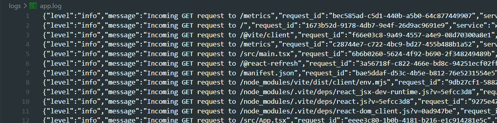
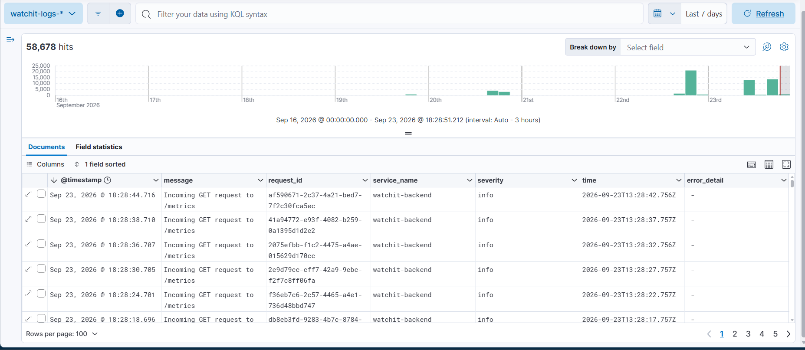
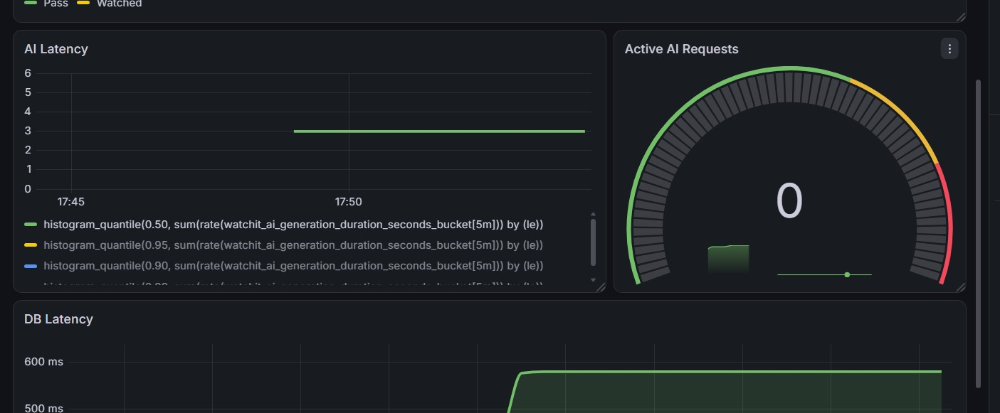
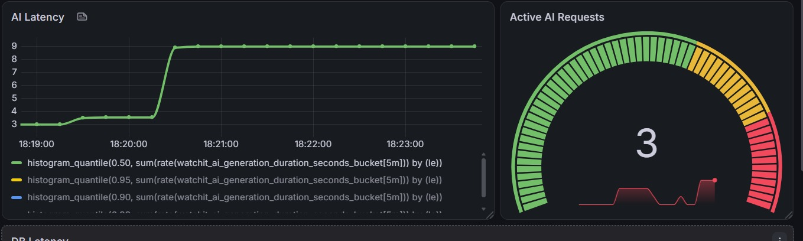
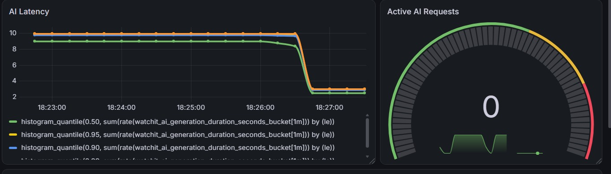

# Assignment 1: Observability Report

## Part A: WatchIt

**The Problem:**
Finding the right movie to watch is often a hassle. You end up scrolling endlessly on streaming platforms, your watchlists are scattered across different apps, and the recommendations you get are generic instead of based on what you actually like.

**Intended Users:**
Movie fans and casual viewers who want an easier, more interactive way to find new films, keep track of what they want to watch, and get recommendations that are actually personalized to them.

**The Solution:**
WatchIt is an AI-powered movie recommendation app (a Single Page Application). It has a doom-scrolling swiping interface where users can mark movies as Watched, Watchlist, Pass, or Ignore. The main feature is "Cine Noir," an AI chat assistant that sends the same request to two different AI providers (Gemini and OpenRouter) at once and uses whichever one replies first. It looks at the user's swipe history stored in PostgreSQL to give recommendations that fit their taste.

**What Works:**
The swipe interface (including keyboard controls on desktop), automatic movie info fetching from TMDB, a filterable personal dashboard, login through Firebase, and the full AI chat feature all work and are connected to the PostgreSQL database through Drizzle ORM.

**How to Try It:**
The live version is deployed here: https://watch-it-rn.vercel.app/

To run the observability setup locally for this assignment, check out the `README.md` file.

## Part B: Metrics

I added a Prometheus client to my Node.js/Express backend and exposed a `/metrics` endpoint that Prometheus can read.

| Metric Name | Purpose | Type | Unit | Labels | Code Location | Grafana Query |
| :--- | :--- | :--- | :--- | :--- | :--- | :--- |
| `watchit_movie_swipes_total` | Tracks what users do with movies (business metric) | Counter | Swipes | `action` | `app.ts` - inside the `/api/swipe` POST route | `sum(watchit_movie_swipes_total) by (action)` |
| `watchit_active_ai_requests` | Tracks how many AI requests are running right now (app metric) | Gauge | Requests | None | `gemini.ts` - wraps the `Promise.any` AI race | `watchit_active_ai_requests` |
| `watchit_ai_generation_duration_seconds` | Tracks how long the AI takes to respond (app metric) | Histogram | Seconds | `le` (buckets) | `gemini.ts` - times the LLM network request | `histogram_quantile(0.90, sum(rate(watchit_ai_generation_duration_seconds_bucket[1m])) by (le))` |
| `watchit_db_query_duration_seconds` | Tracks how long PostgreSQL queries take (app metric) | Summary | Seconds | `quantile` | `app.ts` - inside the `/api/profile` GET route | `watchit_db_query_duration_seconds{quantile="0.95"}` |
| `watchit_ai_wins_total` | Tracks which AI provider is the fastest, including local fallbacks (business metric) | Counter | Wins | `provider` | `gemini.ts` - inside the `Promise.any` race helper | `sum(watchit_ai_wins_total) by (provider)` |

### Grafana Charts Explained
*   **Swipes (Counter):** Shows the total number of user actions, split by the `action` label (for example, comparing how many movies were marked "Watched" versus "Pass").
*   **Active Requests (Gauge):** Shows in real time how many AI requests are running. It goes up when multiple users ask for recommendations at once and drops back to 0 when things are idle.
*   **AI Latency p95 (Histogram):** Uses `histogram_quantile` to work out the 90th percentile of AI response times over the last minute, so we can see how slow the worst-case requests get.
*   **DB Latency p95 (Summary):** Uses the base Summary metric so Grafana can automatically pull and label the p50, p90, and p95 lines to keep an eye on database performance over time.
*   **AI Race Winners (Pie Chart):** Uses our new counter to display which source answered user prompts, either the faster of the two live providers (`Gemini` or `OpenRouter`), or `Local_Vault` which I added just for testing observability on the rare occasions both live providers fail and the app falls back to its offline recommendations.

### Machine Metrics (Node Exporter)

Alongside the app's own metrics, I added Node Exporter to the Docker Compose setup to track the health of the machine the app runs on. Prometheus scrapes Node Exporter's `:9100` endpoint every 5 seconds, the same as it does for the app's `/metrics` endpoint, and every metric from it is labelled `machine="Host-Machine"` so it's clear which machine the numbers belong to.

Rather than building the CPU/memory/disk/network panels by hand, I imported Grafana's official **Node Exporter Full** community dashboard (dashboard ID `1860`) and pointed it at my Prometheus data source. This gave me a full dashboard covering:
*   **CPU usage** — per-core and overall CPU utilization.
*   **Memory usage** — used vs. available RAM.
*   **Disk usage** — free vs. used space, and disk I/O.
*   **Network traffic** — bytes sent and received per second.

All panels are automatically scoped to the `Host-Machine` machine label set in `prometheus.yml`. This is separate from the app metrics above, it's tracking the health of the underlying machine rather than anything about WatchIt itself, but it's useful for spotting cases where the app looks slow because the host machine is under load, not because of a bug in the app.


## Part C: Logs

**1. What I log, why, and where:**
I log every incoming HTTP request and any API errors using the `winston` library in Node.js. Requests are logged through a global middleware in `app.ts`, which attaches a unique `request_id` so I can trace a single request as it moves through the app. Logs are written locally to `logs/app.log` in JSON format. I mapped the service name to the field `service_name` instead of `service` to avoid a naming conflict with Elasticsearch's built-in schema.



**2. How Filebeat Collects and Parses Logs:**
Filebeat runs in Docker and watches the log file through a `filestream` input mapped to a read-only volume (`/app-logs`). It reads each line as `ndjson` and sends it straight to Elasticsearch. I turned off Filebeat's default data streams and used a custom index template (`watchit-logs-*`) instead, since the default one was clashing with other local projects.

**3. Where Logs Live and How Long They Last:**
Logs are stored in a local Elasticsearch container. I search them in Kibana using the `watchit-logs-*` data view. Because this is a local development setup, old logs are completely deleted whenever the Docker containers are spun down without persistent volumes (docker compose down -v). In a production environment, Index Lifecycle Management (ILM) would be configured in Elasticsearch to automatically delete daily index patterns (like watchit-logs-*) older than 30 days.



**4. Searching in Kibana:**
To trace a specific request or debug a problem, I use the KQL search bar in the Discover tab. For example:
`severity: "error" and request_id: "36fcadd0-04a3-43fc-a22d-3945387cd478"`

**Sample Stored Log:**
```json
{
  "level": "info",
  "message": "Incoming POST request to /api/swipe",
  "time": "2026-09-19T15:08:42.919Z",
  "service_name": "watchit-backend",
  "severity": "info",
  "request_id": "47c63250-9b44-4ac1-92ab-adffc6701751"
}
```

## Part D: System Design

### 1. Architecture Diagram


**What each part does, and how they talk to each other**
*   **React 19 SPA (browser):** The frontend, built with Vite. It calls the backend's `/api/*` routes over HTTPS, and I separately open the Grafana and Kibana pages to check dashboards and logs.
*   **Node.js 22 / Express 4 backend (runs on the host machine, not in Docker):** `app.ts` has all the app's routes, the Winston logger, and the `prom-client` metrics setup that serves `GET /metrics`. It runs directly on the host on port 3000 instead of in Docker so I keep hot-reloading while developing.
*   **PostgreSQL (external, hosted):** The only place all app data is permanently stored. Users, movies, swipes, conversations, and messages, reached through a SQL connection via Drizzle ORM using `DATABASE_URL`.
*   **TMDB / Gemini / OpenRouter APIs (external):** TMDB supplies movie details; the two AI providers are called at the same time with `Promise.any()` in `server/gemini.ts`, and only the fastest response is actually used. If both fail, the app returns a small set of hardcoded fallback recommendations instead of erroring out.
*   **Filebeat (container):** Watches `logs/app.log` through a read-only Docker volume mount (`./logs -> /app-logs`), reads each line as NDJSON, and sends the parsed entries to Elasticsearch over HTTP. Filebeat is the one that pushes the data — it starts the connection as soon as new lines show up.
*   **Elasticsearch (container):** Stores and indexes the logs Filebeat sends it, under a index that rotates daily: `watchit-logs-YYYY.MM.dd`.
*   **Kibana (container):** Lets me search and filter logs stored in Elasticsearch using the `watchit-logs-*` index pattern.
*   **Prometheus (container):** Every 5 seconds, it checks two endpoints: the backend's `GET /metrics` (reached through `host.docker.internal:3000` since the backend isn't inside Docker) and Node Exporter's `:9100`.
*   **Node Exporter (container):** Reports hardware stats (CPU, memory, disk, network) for the machine running Docker, labelled `machine="Host-Machine"` in Prometheus.
*   **Grafana (container):** Runs PromQL queries against Prometheus whenever a dashboard is opened or refreshed, and draws the charts I look at in the browser.

**Where data is stored, and why**
*   **PostgreSQL** holds the only permanent copy of the app's data. It was already being used for the live version on Vercel, so reusing it locally means I only need to maintain one schema and one connection string instead of two.
*   **`logs/app.log`** is a plain file on disk, not a database. This keeps things simple: Winston writes to it directly, it survives app restarts, and it's exactly the kind of file Filebeat is built to watch.
*   **Elasticsearch** holds a searchable copy of the logs, not the only copy as `app.log` on the disk is still the original. I didn't set up a named Docker volume for it, so its data is wiped if I run `docker compose down -v`. But thats fine since the index can just be rebuilt from the log file if needed.
*   **Prometheus's storage** works the same way, it's local to the container and can be safely lost, since it just refills itself from the next scrape. It's a monitoring cache, not somewhere I need to keep data long-term.

**What happens if a component stops working**

| Component | Impact if it goes down |
| :--- | :--- |
| **PostgreSQL** | Every `/api/*` route that touches the database returns a 500 error. Login still works, but the user's data can't be saved or read. This is the only part of the monitoring setup that would actually be noticeable to users. |
| **TMDB API** | Movie discovery falls back to whatever's already in the database; new movies stop being added, and poster/rating info on AI recommendations is just skipped. |
| **Gemini or OpenRouter** | No real impact. `Promise.any()` just uses whichever of the two responds first. If both are down or fail, the app still doesn't error out as it falls back to a small set of hardcoded recommendations ("Local Vault") so the chat feature still returns something usable. |
| **Prometheus** | No new metrics get collected while it's down, so Grafana shows a gap for that time. The app itself keeps running fine. `/metrics` is still there, just nobody's reading it. |
| **Grafana** | Dashboards become unreachable, but Prometheus keeps collecting and storing data in the background. Nothing is lost, it's just not viewable until Grafana comes back. |
| **Node Exporter** | System stats like CPU, memory, disk, and network stop updating. App metrics aren't affected since they come from a different source. |
| **Filebeat** | Logs keep piling up safely in `app.log` on disk. Nothing gets sent to Elasticsearch until Filebeat is back up, and then it picks up from where it left off. |
| **Elasticsearch** | Filebeat's requests fail and it keeps retrying; Kibana stops working since it has nothing to search. The app's own logging to `app.log` isn't affected at all. |
| **Kibana** | Log search becomes unavailable, but the data in Elasticsearch is safe and untouched; the app itself is unaffected. |

Basically, the entire monitoring setup (Prometheus, Grafana, Node Exporter, Filebeat, Elasticsearch, Kibana) can go down without the app itself breaking for users. It's purely there to watch what's happening. PostgreSQL is the only dependency that's directly noticeable to users if it goes down; even both AI providers failing at once doesn't break the chat feature, since the Local Vault fallback keeps it usable.

### 2. Following a Metric and a Log

**Following a metric: `watchit_ai_generation_duration_seconds`**
This one tracks how long it takes for the AI chat to actually come back with a recommendation, basically how long the app is waiting on the `Promise.any()` race between Gemini and OpenRouter.

**Step 1 — The code updates it:** Over in `server/gemini.ts`, right before the race kicks off I start a timer (along with bumping `activeAiRequests`), and I only stop it in a `finally` block so it fires no matter how the request ends up finishing:

```typescript
activeAiRequests.inc();
const endAiTimer = aiLatencyHistogram.startTimer();

try {
  const winner = await Promise.any([
    runRace("Gemini", fetchGemini()),
    runRace("OpenRouter", fetchOpenRouter("meta-llama/llama-3.1-8b-instruct"))
  ]);
  aiProviderWins.labels({ provider: winner.provider }).inc();
  return winner.data;
} catch (error) {
  const fallbackData = await fetchLocalVault();
  aiProviderWins.labels({ provider: "Local_Vault" }).inc();
  return fallbackData;
} finally {
  endAiTimer(); // records how long it took, into the right bucket
  activeAiRequests.dec();
}
```

I put the timer in `finally` on purpose. If I'd only stopped it after a successful race, I'd have ended up with a histogram that only ever sees the "good" requests and just silently ignores anything that fell back to the Local Vault. That would've made the app look faster than it actually is, since the fallback path takes about 800ms on its own. This way, every request gets timed: win, slow win, or fallback.

The histogram itself is defined in `server/metrics.ts` with buckets at `[0.1, 0.5, 1, 2, 3, 5, 8, 10, 15]` seconds. So say a request takes 1.3 seconds, that gets counted in the 2s, 3s, 5s, 8s, 10s, and 15s buckets (anything 1.3s or under), and it also adds 1 to `watchit_ai_generation_duration_seconds_count` and 1.3 to `..._sum`.

**Step 2 — Prometheus grabs it:** Every 5 seconds (that's the `scrape_interval: 5s` in `prometheus.yml`), Prometheus hits `host.docker.internal:3000/metrics` and just reads whatever the current bucket counts are, as plain text, something like:

```text
watchit_ai_generation_duration_seconds_bucket{le="1"} 12
watchit_ai_generation_duration_seconds_bucket{le="2"} 12
watchit_ai_generation_duration_seconds_bucket{le="3"} 34
watchit_ai_generation_duration_seconds_bucket{le="5"} 40
watchit_ai_generation_duration_seconds_bucket{le="8"} 41
watchit_ai_generation_duration_seconds_bucket{le="+Inf"} 41
watchit_ai_generation_duration_seconds_sum 58.7
watchit_ai_generation_duration_seconds_count 41
```

It saves that whole snapshot with a timestamp. Nothing gets overwritten, every scrape is just another data point, so over time you end up with a full history to look back through.

**Step 3 — Grafana pulls it up:** Whenever I open or refresh the dashboard, a Grafana panel runs this against Prometheus:

```promql
histogram_quantile(0.90, sum(rate(watchit_ai_generation_duration_seconds_bucket[1m])) by (le))
```

The `rate(...[1m])` part turns those raw bucket counts into a per-second rate over the last minute, and `histogram_quantile(0.90, ...)` works out roughly where the 90th percentile sits. It's just a line chart over time, so if OpenRouter suddenly starts lagging and only Gemini's staying fast, I'd see that line jump almost immediately.

**Following a log: the incoming-request log line**
This is just the log line that gets written for literally every request that hits the backend.

**Step 1 — The code writes it:** In `app.ts` there's a middleware that runs before any route, and it generates a request ID and logs it:

```typescript
app.use((req, res, next) => {
  const requestId = randomUUID();
  req.headers['x-request-id'] = requestId;
  logger.info({
    message: `Incoming ${req.method} request to ${req.url}`,
    severity: 'info',
    request_id: requestId
  });
  next();
});
```

Winston (in `server/logger.ts`) tacks on a `time` timestamp and a fixed `service_name: "watchit-backend"` field, packages the whole thing as one JSON object, and appends it to `logs/app.log`. So for something like a real `POST /api/swipe` request, the line that actually lands on disk looks like this:

```json
{
  "level": "info",
  "message": "Incoming POST request to /api/swipe",
  "time": "2026-09-19T15:08:42.919Z",
  "service_name": "watchit-backend",
  "severity": "info",
  "request_id": "47c63250-9b44-4ac1-92ab-adffc6701751"
}
```

**Step 2 — Filebeat picks it up:** Filebeat's watching `/app-logs/*.log` (which is just the read-only mount of my `./logs` folder) and grabs the new line as soon as it shows up. It reads it as `ndjson`, and since I set `target: ""` in `filebeat.yml`, all the fields land flat at the top level instead of getting nested under something. From there it ships the entry over to Elasticsearch at `elasticsearch:9200`, into whatever the day's index is: `watchit-logs-2026.09.19` in this case, since that gets generated automatically.

**Step 3 — Elasticsearch stores it:** It gets indexed with the same fields it came in with, plus a handful Filebeat/Elasticsearch tack on themselves: `@timestamp`, `agent`, `host`, that kind of thing. One thing that tripped me up early on: both my own `time` field and Filebeat's `@timestamp` end up in the document, and Kibana defaults to using `@timestamp` for its time filter, not mine. I also had to rename my field to `service_name` instead of `service`, because Elasticsearch's schema reserves `service` for something else internally, and using the plain name caused 400 errors the first time I tried ingesting logs.

**Step 4 — Kibana finds it:** In Kibana, I select the `watchit-logs-*` index pattern and search `request_id: "47c63250-9b44-4ac1-92ab-adffc6701751"`. This returns exactly that one log entry, showing the fields: `time`, `service_name`, `severity`, `message`, and `request_id`, as separate, searchable fields instead of one block of text. Searching `severity: "error"` instead would show every error log across the whole app, like the ones written by the `/api/chat` error handler, each still carrying its own `request_id` so I can trace it back to the exact request that caused it.

## Part E: Experiments

### 1. Reproducing a Problem

**Problem Chosen:** A slow upstream AI response causing requests to pile up.

**1. Normal behavior**
I set up a repeatable test using a browser console script that sent a logged-in `POST` request to `/api/chat` every 3 seconds:
```javascript
const aiTraffic = setInterval(async () => {
  fetch("http://localhost:3000/api/chat", { /* rest of the code*/ });
}, 3000);

```

Under normal conditions (using a mock delay of 2000ms to stand in for a typical AI response time), the app handled requests fine. Grafana showed a steady baseline latency of around ~3 seconds (2s mock delay plus some network overhead), using a 1-minute rate window. The Active AI Requests gauge went back down to 0 after each request finished.

*Query used:* `histogram_quantile(0.95, sum(rate(watchit_ai_generation_duration_seconds_bucket[1m])) by (le))`




**2. Prediction**
If I add an artificial 8000ms delay into the route handler, I'd expect the `histogram_quantile` chart to jump to around ~9 seconds. Since the 8-second delay is longer than the 3-second gap between requests, requests will start overlapping. So the Active AI Requests gauge should climb to 2 or 3 and stay there instead of dropping to 0. The logs won't show any `500` errors, since the requests still succeed eventually, they're just slow, but the gap between when a request comes in and when it finishes will get noticeably wider.

**3. Introducing the problem**
I added `await new Promise(resolve => setTimeout(resolve, 8000));` into `server/gemini.ts` and restarted the backend. As expected, the p95 latency line in Grafana jumped sharply to around 9 seconds, and the gauge climbed to 3 concurrent requests, clearly showing the backlog building up.




**4. Cause and effect**
This is basically what would happen if an upstream provider like Gemini or OpenRouter had network problems or was just slow to respond. From a user's point of view, the app would seem to freeze for over 8 seconds every time they interacted with it which becomes a pretty bad experience. Since no `500` errors are thrown, normal error logging wouldn't catch this at all, which is exactly why having latency histograms and request gauges matters.

**5. Recovery**
I removed the 8000ms delay from the code, restarted the backend to clear out the stuck requests, and let the traffic script keep running. Within about a minute (matching the `[1m]` rate window in the query), the p95 latency dropped back down to the 3-second baseline, and the gauge cleared out and went back to 0.




### 2. Cardinality Explosion

A cardinality explosion is when a metric label ends up with too many different possible values, like a unique ID. Prometheus then has to make a whole new time series for every single value, which is way more than it can really handle.

**1. The Experiment**
I added a `request_id` label to a test counter called `watchit_cardinality_test_total`. Then I added a loop to the `/api/chat` route that makes 100 unique `randomUUID()` values and bumps the counter once for each one.

```typescript
for (let i = 0; i < 100; i++) {
  badCardinalityCounter.labels({ request_id: randomUUID() }).inc();
}
```

**2. Series Growth**
After triggering the route once from the UI, I checked Prometheus to see how many separate time series got created.
*Query used:* `count(watchit_cardinality_test_total)`
The result was exactly `100`. So instead of just bumping one counter 100 times, Prometheus actually made 100 completely separate time series from a single request.


**3. Cleanup**
I took the request_id label out of the code, deleted the loop, and restarted the app. After waiting for the next 5-second Prometheus scrape, I hit the chat route again. Running the count() query showed the number of time series stayed at exactly 100 and didn't grow, so the explosion had stopped.

**4. Why this matters at a larger scale**
If this happened for real, say at 10,000 requests a minute, tagging metrics with a unique `request_id` would create 10,000 brand new time series every single minute. That would eat up CPU and memory fast and could crash the Prometheus server. The fix is simple: only use labels that have a small, fixed set of values, like HTTP method or status code. Anything unique per request, like a `request_id`, belongs in the logs instead. Elasticsearch is actually built to handle searching through that kind of high-cardinality data, Prometheus isn't.